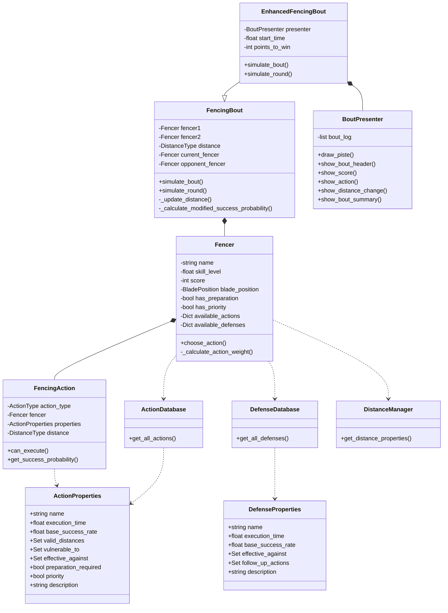

# Fencing Simulator Documentation

## Architecture Overview

The fencing simulator is built with a modular architecture that separates concerns between action definitions, state management, simulation logic, and presentation.

### Class Dependency Diagram



## Core Components

### 1. Enums and Data Types

#### `DistanceType`
- Defines possible distances between fencers
- Values: OUT_OF_DISTANCE, LONG, MEDIUM, LUNGE, SHORT, INFIGHTING

#### `ActionType`
- Defines all possible fencing actions
- Categories:
  - Preparation Actions (ADVANCE, RETREAT, etc.)
  - Simple Attacks (DIRECT_THRUST, DISENGAGE, etc.)
  - Compound Attacks (ONE_TWO, DOUBLE_DISENGAGE, etc.)
  - Counter Attacks (STOP_THRUST, TIME_THRUST, etc.)
  - Blade Actions (BEAT, PRESSURE, etc.)

#### `DefenseType`
- Defines all possible defensive actions
- Categories:
  - Simple Parries (PARRY_1 through PARRY_8)
  - Circular Parries (COUNTER_SIXTE, COUNTER_QUARTE, etc.)
  - Semi-circular Parries
  - Compound Parries

#### `BladePosition`
- Defines possible blade positions
- Values: SIXTE, QUARTE, SEPTIME, OCTAVE, etc.

### 2. Data Classes

#### `ActionProperties`
Properties for each action:
```python
@dataclass
class ActionProperties:
    name: str
    execution_time: float
    base_success_rate: float
    valid_distances: Set[DistanceType]
    vulnerable_to: Set[DefenseType]
    effective_against: Set[DefenseType]
    preparation_required: bool
    priority: bool
    description: str
```

#### `DefenseProperties`
Properties for each defense:
```python
@dataclass
class DefenseProperties:
    name: str
    execution_time: float
    base_success_rate: float
    effective_against: Set[ActionType]
    follow_up_actions: Set[ActionType]
    description: str
```

### 3. Core Classes

#### `Fencer`
Represents a fencer in the bout:
- Maintains fencer state (score, position, etc.)
- Makes tactical decisions
- Manages available actions and defenses

#### `FencingAction`
Represents a specific action being executed:
- Calculates success probability
- Checks execution validity
- Applies modifiers based on context

#### `FencingBout`
Manages the bout simulation:
- Controls flow of the bout
- Updates scores and states
- Manages distance and timing

#### `EnhancedFencingBout`
Extends `FencingBout` with improved visualization:
- Adds visual presentation
- Maintains bout statistics
- Provides detailed summaries

### 4. Database Classes

#### `ActionDatabase`
Central repository for action definitions:
- Defines all possible actions
- Maintains action properties
- Provides action lookup functionality

#### `DefenseDatabase`
Central repository for defense definitions:
- Defines all possible defenses
- Maintains defense properties
- Provides defense lookup functionality

#### `DistanceManager`
Manages distance-related properties:
- Defines valid actions for each distance
- Maintains distance transitions
- Provides distance-specific modifiers

### 5. Presentation

#### `BoutPresenter`
Handles visual presentation of the bout:
- Draws ASCII representation of the piste
- Shows bout progress and statistics
- Manages color coding and formatting
- Maintains bout log for analysis

## Usage Flow

1. Create fencers with skill levels
2. Initialize bout with fencers
3. Simulate bout:
   - Update distance
   - Choose actions
   - Calculate success
   - Update scores
4. Present results and statistics

## Example Usage

```python
def main():
    # Create fencers
    fencer1 = Fencer("Alice", skill_level=0.7)
    fencer2 = Fencer("Bob", skill_level=0.6)
    
    # Create and simulate bout
    bout = EnhancedFencingBout(fencer1, fencer2)
    bout.simulate_bout()

if __name__ == "__main__":
    main()
```

## Extending the Simulator

To add new features:

1. Add new enums for new action/defense types
2. Define properties in respective databases
3. Update success calculation logic if needed
4. Add presentation elements for new features
