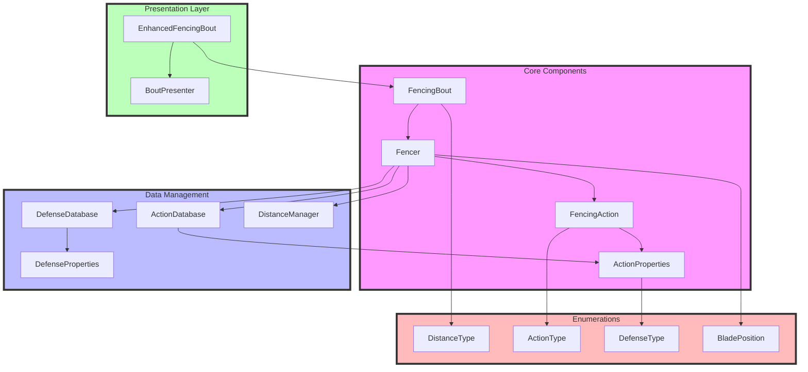
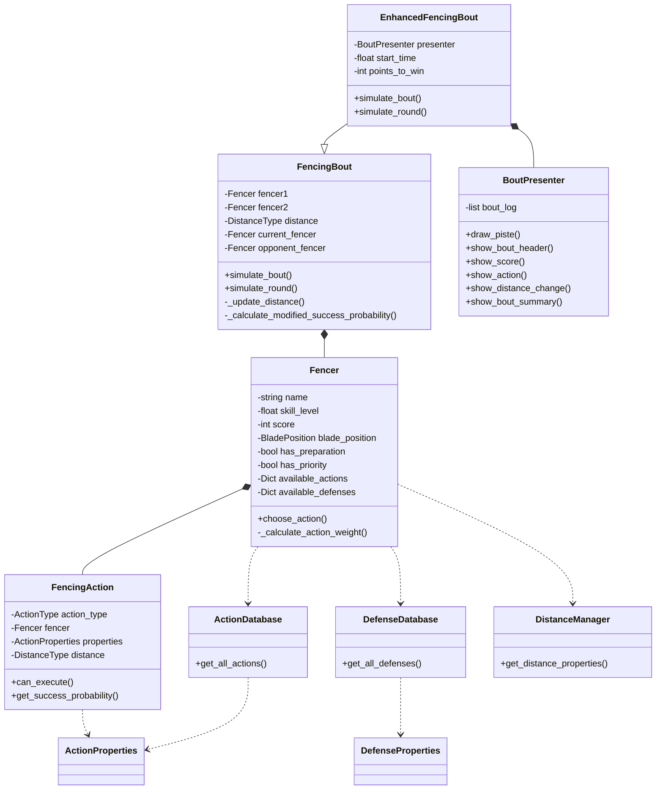

# Fencing Simulator Architecture

## System Architecture Diagram



## Class Diagram



## Component Descriptions

### Core Components
- **FencingBout**: Main simulation controller
- **Fencer**: Represents a fencer with their properties and actions
- **FencingAction**: Represents specific fencing actions and their execution

### Data Management
- **ActionDatabase**: Repository of all possible actions
- **DefenseDatabase**: Repository of all possible defenses
- **DistanceManager**: Manages distance relationships and valid actions

### Presentation Layer
- **EnhancedFencingBout**: Extends FencingBout with visual presentation
- **BoutPresenter**: Handles visual output and statistics

### Enumerations
- **DistanceType**: Possible distances between fencers
- **ActionType**: Types of actions available
- **DefenseType**: Types of defenses available
- **BladePosition**: Possible blade positions

## Directory Structure
TODO: Update and modularize directory structure
```
fencing_simulator/
├── README.md
├── ARCHITECTURE.md
├── src/
│   ├── __init__.py
│   ├── core/
│   │   ├── __init__.py
│   │   ├── bout.py
│   │   ├── fencer.py
│   │   └── action.py
│   ├── data/
│   │   ├── __init__.py
│   │   ├── action_database.py
│   │   ├── defense_database.py
│   │   └── distance_manager.py
│   └── presentation/
│       ├── __init__.py
│       ├── enhanced_bout.py
│       └── presenter.py
└── tests/
    ├── __init__.py
    ├── test_bout.py
    ├── test_fencer.py
    └── test_action.py
```