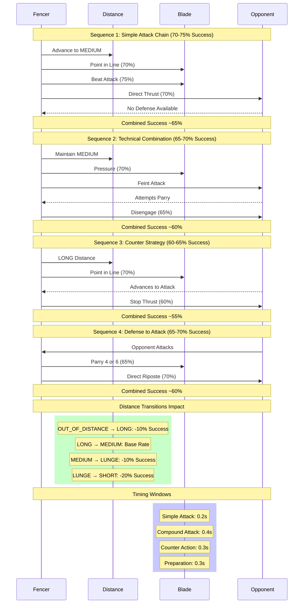
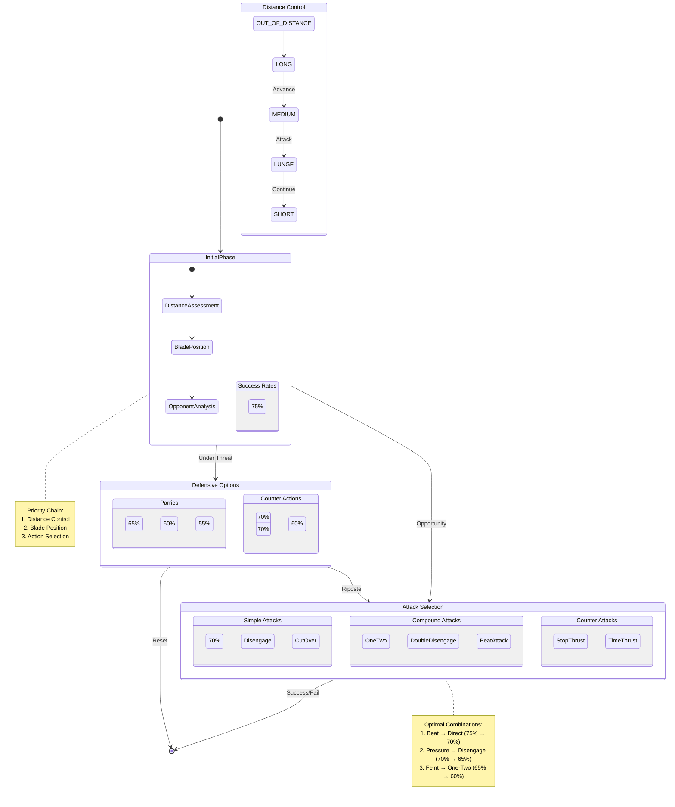

# Strategys

## Action Sequences

```mermaid

sequenceDiagram
    participant F1 as Fencer
    participant D as Distance
    participant B as Blade
    participant O as Opponent

    %% Sequence 1: High Probability Simple Attack
    Note over F1,O: Sequence 1: Simple Attack Chain (70-75% Success)
    F1->>D: Advance to MEDIUM
    F1->>B: Point in Line (70%)
    F1->>B: Beat Attack (75%)
    F1->>O: Direct Thrust (70%)
    O-->>F1: No Defense Available
    Note over F1,O: Combined Success ~65%

    %% Sequence 2: Technical Combination
    Note over F1,O: Sequence 2: Technical Combination (65-70% Success)
    F1->>D: Maintain MEDIUM
    F1->>B: Pressure (70%)
    F1->>O: Feint Attack
    O-->>F1: Attempts Parry
    F1->>O: Disengage (65%)
    Note over F1,O: Combined Success ~60%

    %% Sequence 3: Counter-Attack Setup
    Note over F1,O: Sequence 3: Counter Strategy (60-65% Success)
    F1->>D: LONG Distance
    F1->>B: Point in Line (70%)
    O-->>F1: Advances to Attack
    F1->>O: Stop Thrust (60%)
    Note over F1,O: Combined Success ~55%

    %% Sequence 4: Defensive Riposte
    Note over F1,O: Sequence 4: Defense to Attack (65-70% Success)
    O->>F1: Opponent Attacks
    F1->>B: Parry 4 or 6 (65%)
    F1->>O: Direct Riposte (70%)
    Note over F1,O: Combined Success ~60%

    %% Transitions
    Note over F1,O: Distance Transitions Impact
    rect rgb(200, 255, 200)
        Note over D: OUT_OF_DISTANCE → LONG: -10% Success
        Note over D: LONG → MEDIUM: Base Rate
        Note over D: MEDIUM → LUNGE: -10% Success
        Note over D: LUNGE → SHORT: -20% Success
    end

    %% Optimal Timing Windows
    Note over F1,O: Timing Windows
    rect rgb(200, 200, 255)
        Note over B: Simple Attack: 0.2s
        Note over B: Compound Attack: 0.4s
        Note over B: Counter Action: 0.3s
        Note over B: Preparation: 0.3s
    end
```

## Decision Flow

```mermaid

stateDiagram-v2
    [*] --> InitialPhase
    
    state InitialPhase {
        [*] --> DistanceAssessment
        DistanceAssessment --> BladePosition
        BladePosition --> OpponentAnalysis
        
        state "Success Rates" as InitialRates {
            PointInLine: 70%
            EngagePrep: 75%
            DirectThrust: 70%
        }
    }
    
    state "Attack Selection" as AttackPhase {
        state "Simple Attacks" as SimpleAttacks {
            DirectThrust
            Disengage
            CutOver
        }
        
        state "Compound Attacks" as CompoundAttacks {
            OneTwo
            DoubleDisengage
            BeatAttack
        }
        
        state "Counter Attacks" as CounterAttacks {
            StopThrust
            TimeThrust
        }
    }
    
    state "Defensive Options" as DefensePhase {
        state "Parries" as Parries {
            Simple: 65%
            Circular: 60%
            Compound: 55%
        }
        
        state "Counter Actions" as CounterActions {
            StopHit: 60%
            PointInLine: 70%
        }
    }
    
    InitialPhase --> AttackPhase: Opportunity
    InitialPhase --> DefensePhase: Under Threat
    
    AttackPhase --> [*]: Success/Fail
    DefensePhase --> AttackPhase: Riposte
    DefensePhase --> [*]: Reset
    
    state "Distance Control" as DistanceControl {
        OUT_OF_DISTANCE --> LONG
        LONG --> MEDIUM: Advance
        MEDIUM --> LUNGE: Attack
        LUNGE --> SHORT: Continue
    }
    
    note right of InitialPhase
        Priority Chain:
        1. Distance Control
        2. Blade Position
        3. Action Selection
    end note
    
    note right of AttackPhase
        Optimal Combinations:
        1. Beat → Direct (75% → 70%)
        2. Pressure → Disengage (70% → 65%)
        3. Feint → One-Two (65% → 60%)
    end note
```

