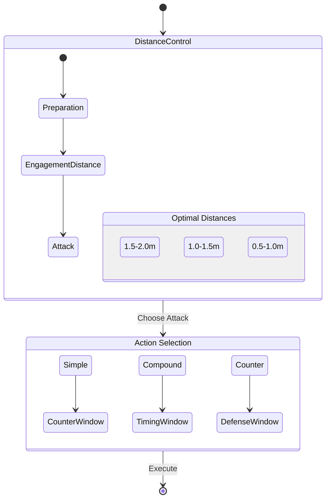
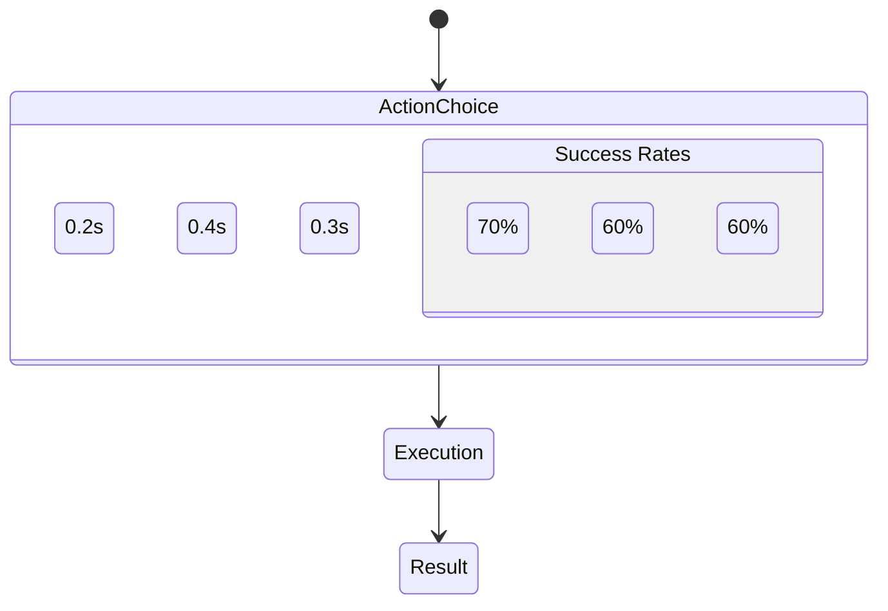
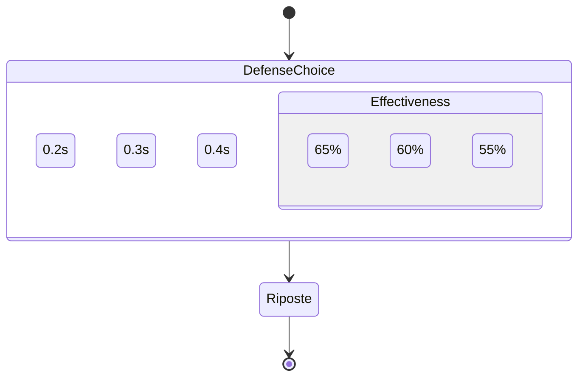

# Fencing Strategies Analysis

## High-Probability Actions

Based on our state machine's success probabilities and tactical relationships:

### 1. Distance Management Strategies



#### Key Distance Tactics:
1. **Medium Distance (1.5-2.0m)**
   - Best for preparation
   - Allows compound attacks
   - Safe distance for defense
   - Success Rate: ~70% for prepared actions

2. **Lunge Distance (1.0-1.5m)**
   - Optimal for direct attacks
   - Higher success rate for simple attacks
   - Quick recovery possible
   - Success Rate: ~65% for well-timed actions

3. **Short Distance (0.5-1.0m)**
   - High-risk, high-reward
   - Best for blade actions
   - Requires excellent timing
   - Success Rate: ~60% but faster execution

### 2. Action Selection Strategy



#### Highest Success Rate Actions:
1. **Direct Thrust**
   - Base success rate: 70%
   - Execution time: 0.2s
   - Best against: Unprepared opponent
   - Counter: Simple parries

2. **Beat Direct**
   - Base success rate: 65%
   - Execution time: 0.35s
   - Best against: Engaged blades
   - Counter: Counter-attacks

3. **Point in Line**
   - Base success rate: 70%
   - Execution time: 0.2s
   - Best against: Aggressive opponents
   - Counter: Beat attacks

### 3. Defensive Strategies



#### Most Effective Defenses:
1. **Simple Parries (4 and 6)**
   - Success rate: 65%
   - Execution time: 0.2s
   - Best against: Direct attacks
   - Follow-up: Quick riposte

2. **Counter of Sixte**
   - Success rate: 60%
   - Execution time: 0.3s
   - Best against: Disengages
   - Follow-up: Direct thrust

## Winning Combinations

### 1. Aggressive Strategy
```python
Priority Actions:
1. Point in Line → Direct Thrust (70% → 70%)
2. Beat → Direct Thrust (75% → 70%)
3. Pressure → Disengage (70% → 65%)

Distance: Maintain MEDIUM to LUNGE
Success Factor: Keep initiative
```

### 2. Defensive Strategy
```python
Priority Actions:
1. Parry 4/6 → Riposte (65% → 70%)
2. Counter-Parry → Direct (60% → 70%)
3. Distance Control → Stop Thrust (60% → 60%)

Distance: LONG to MEDIUM
Success Factor: Wait for opponent's commitment
```

### 3. Technical Strategy
```python
Priority Actions:
1. Feint → Disengage (60% → 65%)
2. Beat → One-Two (75% → 60%)
3. Pressure → Cut Over (70% → 65%)

Distance: MEDIUM
Success Factor: Create and exploit openings
```

## Statistical Analysis of Success Rates

### Action Type Success Rates:
```
Simple Attacks:   65-70%
Compound Attacks: 55-60%
Counter Attacks:  60-65%
Blade Actions:    70-75%
```

### Distance Success Modifiers:
```
LONG:       -10%
MEDIUM:     +0%
LUNGE:      -10%
SHORT:      -20%
INFIGHTING: -30%
```

## Optimization Strategy

1. **Preparation Phase**
   - Start with Point in Line (70% success)
   - Maintain MEDIUM distance
   - Look for blade contact

2. **Attack Phase**
   - Prefer simple attacks (higher success rate)
   - Use blade actions to create openings
   - Keep compound attacks as surprise elements

3. **Defense Phase**
   - Rely on simple parries (faster execution)
   - Use distance for defense (retreat)
   - Counter-attack only with timing advantage

4. **Recovery Phase**
   - Return to MEDIUM distance
   - Reassess opponent's position
   - Reset to preparation phase

## Key Tactical Principles

1. **Distance Control**
   ```python
   optimal_distance = {
       "preparation": DistanceType.MEDIUM,
       "attack": DistanceType.LUNGE,
       "defense": DistanceType.LONG,
       "recovery": DistanceType.MEDIUM
   }
   ```

2. **Action Selection**
   ```python
   if opponent.is_aggressive:
       use_counter_attacks()
   elif opponent.is_defensive:
       use_blade_actions()
   else:
       use_simple_attacks()
   ```

3. **Time Management**
   ```python
   if action.execution_time < opponent.reaction_time:
       execute_action()
   else:
       feint_first()
   ```

## Implementation in Code

```python
def choose_optimal_strategy(self, opponent_state, distance):
    if distance == DistanceType.MEDIUM:
        if self.has_preparation:
            return ActionType.BEAT_DIRECT  # 75% → 70%
        else:
            return ActionType.POINT_IN_LINE  # 70%
            
    elif distance == DistanceType.LUNGE:
        if opponent_state.is_attacking:
            return ActionType.STOP_THRUST  # 60%
        else:
            return ActionType.DIRECT_THRUST  # 70%
            
    return ActionType.RETREAT  # Reset position
```