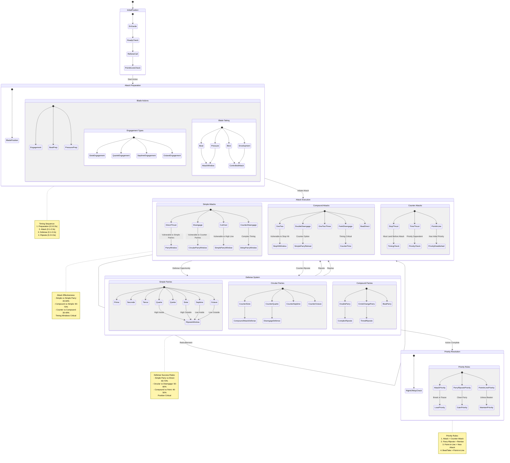

```mermaid
stateDiagram-v2
    [*] --> InitialPosition
    
    state InitialPosition {
        [*] --> EnGarde
        EnGarde --> ReadyCheck
        ReadyCheck --> RefereeCall
        RefereeCall --> PointInLineCheck
    }

    state "Attack Preparation" as PrepPhase {
        [*] --> BladePosition
        
        state "Blade Actions" as BladeActions {
            [*] --> Engagement
            [*] --> BeatPrep
            [*] --> PressurePrep
            
            state "Engagement Types" as EngagementTypes {
                [*] --> SixteEngagement
                [*] --> QuarteEngagement
                [*] --> SeptimeEngagement
                [*] --> OctaveEngagement
            }
            
            state "Blade Taking" as BladeTaking {
                [*] --> Beat
                [*] --> Pressure
                [*] --> Bind
                [*] --> Envelopment
                
                Beat --> AttackWindow
                Pressure --> AttackWindow
                Bind --> ControlledAttack
                Envelopment --> ControlledAttack
            }
        }
    }

    state "Attack Execution" as AttackPhase {
        state "Simple Attacks" as SimpleAttacks {
            [*] --> DirectThrust
            [*] --> Disengage
            [*] --> CutOver
            [*] --> CounterDisengage
            
            DirectThrust --> ParryWindow : Vulnerable to Simple Parries
            Disengage --> CircularParryWindow : Vulnerable to Counter Parries
            CutOver --> SimpleParryWindow : Vulnerable to High Line
            CounterDisengage --> DelayParryWindow : Complex Timing
        }
        
        state "Compound Attacks" as CompoundAttacks {
            [*] --> OneTwo
            [*] --> DoubleDisengage
            [*] --> OneTwoThree
            [*] --> FeintDisengage
            [*] --> BeatDirect
            
            OneTwo --> StopHitWindow : Vulnerable to Stop Hit
            DoubleDisengage --> SimpleParryRetreat : Counter Option
            FeintDisengage --> CounterTime : Timing Critical
        }
        
        state "Counter Attacks" as CounterAttacks {
            [*] --> StopThrust
            [*] --> TimeThrust
            [*] --> PointInLine
            
            StopThrust --> TimingCheck : Must Land Before Attack
            TimeThrust --> PriorityCheck : Priority Dependent
            PointInLine --> PriorityEstablished : Has Initial Priority
        }
    }

    state "Defense System" as DefensePhase {
        state "Simple Parries" as SimpleParries {
            [*] --> Prime
            [*] --> Seconde
            [*] --> Tierce
            [*] --> Quarte
            [*] --> Quinte
            [*] --> Sixte
            [*] --> Septime
            [*] --> Octave
            
            Quarte --> RiposteWindow : High Inside
            Sixte --> RiposteWindow : High Outside
            Septime --> RiposteWindow : Low Inside
            Octave --> RiposteWindow : Low Outside
        }
        
        state "Circular Parries" as CircularParries {
            [*] --> CounterSixte
            [*] --> CounterQuarte
            [*] --> CounterSeptime
            [*] --> CounterOctave
            
            CounterSixte --> CompoundAttackDefense
            CounterQuarte --> DisengageDefense
        }
        
        state "Compound Parries" as CompoundParries {
            [*] --> DoubleParry
            [*] --> CircleChangeParry
            [*] --> BeatParry
            
            DoubleParry --> ComplexRiposte
            CircleChangeParry --> TimedRiposte
        }
    }

    state "Priority Resolution" as PriorityPhase {
        [*] --> RightOfWayCheck
        
        state "Priority Rules" as PriorityRules {
            [*] --> AttackPriority
            [*] --> ParryRipostePriority
            [*] --> PointInLinePriority
            
            AttackPriority --> LosePriority : Break or Pause
            ParryRipostePriority --> GainPriority : Clean Parry
            PointInLinePriority --> MaintainPriority : Unless Beaten
        }
    }

    %% Main Phase Transitions
    InitialPosition --> PrepPhase : Start Action
    PrepPhase --> AttackPhase : Initiate Attack
    AttackPhase --> DefensePhase : Defense Opportunity
    DefensePhase --> PriorityPhase : Action Complete
    
    %% Tactical Combinations
    DefensePhase --> AttackPhase : Riposte
    AttackPhase --> DefensePhase : Counter-Riposte
    AttackPhase --> AttackPhase : Remise
    DefensePhase --> AttackPhase : Reprise
    AttackPhase --> AttackPhase : Redoublement

    note right of AttackPhase
        Attack Effectiveness:
        - Simple vs Simple Parry: 40-60%
        - Compound vs Simple: 60-70%
        - Counter vs Compound: 30-40%
        Timing Windows Critical
    end note

    note right of DefensePhase
        Defense Success Rates:
        - Simple Parry vs Direct: 60-70%
        - Circular vs Disengage: 50-60%
        - Compound vs Feint: 40-50%
        Position Critical
    end note

    note right of PriorityPhase
        Priority Rules:
        1. Attack > Counter-Attack
        2. Parry-Riposte > Remise
        3. Point-in-Line > New Attack
        4. Beat/Take > Point-in-Line
    end note

    note right of PrepPhase
        Timing Sequence:
        1. Preparation (0.3-0.5s)
        2. Attack (0.1-0.3s)
        3. Defense (0.1-0.2s)
        4. Riposte (0.2-0.3s)
    end note
```